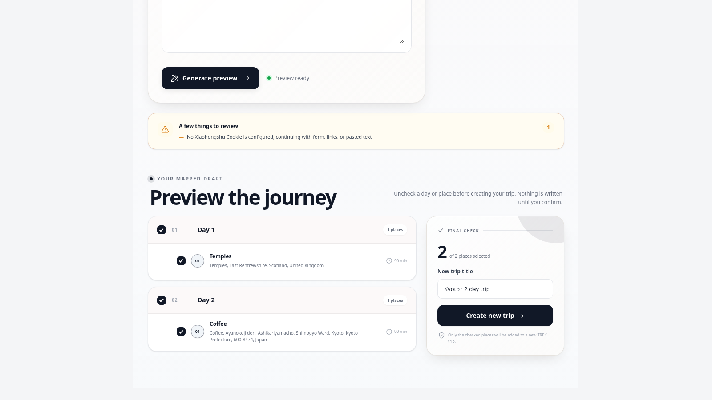

# ai-guide

Turn Xiaohongshu travel notes into a TREK itinerary

## What it does

AI Guide turns a destination, Xiaohongshu note URL, or pasted travel note into a
mapped preview. Every place is resolved to WGS-84 coordinates by the plugin's
own Nominatim client (`server/geo/nominatim.js`) — no host RPC, no map API key,
no changes to TREK's core. After reviewing and deselecting days or places, the
user can create a new TREK trip. Keyword search is optional and degrades to the
form/link/paste flow when a Xiaohongshu session is unavailable. Authenticated
search signs every request with the current `x-s`, `x-t`, `x-s-common`, and
trace headers expected by the Xiaohongshu web API.

## Screenshots

Show it in context. Commit a `docs/screenshot.png` — it's what the store card
shows. A 16:9 image (e.g. 1600×900) with your plugin centred and some margin
looks best (the card crops the edges).

## Permissions

| Permission | Why |
|---|---|
| `ai:invoke` | Extract named places from supplied notes and write bounded itinerary copy. |
| `db:own` | Store resumable per-user planning jobs and drafts. |
| `db:create:trips` | Create the confirmed result as a new trip. |
| `db:read:trips` | Read the days created with the new trip before assigning places. |
| `db:write:places` | Create only the evidence points selected in the preview. |
| `db:write:itinerary` | Assign created places to their previewed days. |
| `db:read:categories` | Read TREK's place categories for itinerary classification. |
| `db:meta` | Mark a created trip with its originating AI Guide job. |
| `hook:user-data` | Delete or export the plugin's own per-user job metadata. |
| `http:outbound:www.xiaohongshu.com` | Read public Xiaohongshu note pages. |
| `http:outbound:edith.xiaohongshu.com` | Try user-authorized session search and note details. |
| `http:outbound:xhslink.com` | Resolve Xiaohongshu short links without following outside the allowed hosts. |
| `http:outbound:nominatim.openstreetmap.org` | Resolve every candidate to WGS-84 coordinates via the plugin's own Nominatim client. |

## Setup

Enable the `llm_parsing` addon and configure TREK's AI provider. The plugin
resolves places with its own Nominatim client — no map API key and no changes
to TREK's core are required.

Optional keyword search uses each user's own secret `xhs_cookie`, entered under
Settings → Plugins. The Cookie never enters the iframe, logs, AI prompts, drafts,
or user-data exports. URL, pasted-text, and form-only planning work without it.

The signing engine is a bundled build of the MIT-licensed `xhshow-js` package.
Its license and the bundled `crypto-js` notice are preserved in
`server/xhs/vendor/THIRD_PARTY_NOTICES.md`.

## License

MIT
